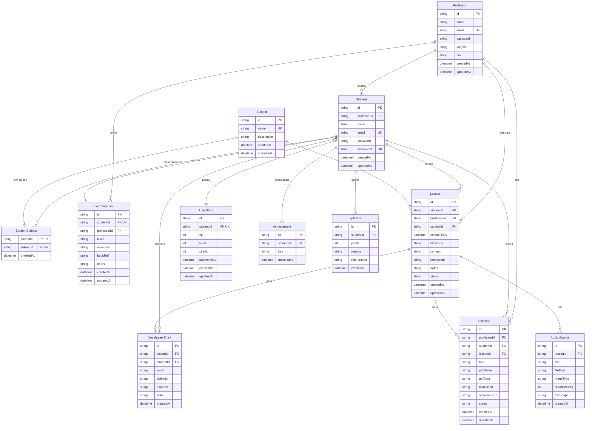

# Database Schema — ActivePDF

> Documento de referência do modelo de dados. O arquivo `prisma/schema.prisma` é a fonte de verdade.  
> Rotas de API são documentadas em `src/openapi.ts`.

---

## Status dos modelos

| Modelo | Tabela Prisma | Schema | Migration | Rotas API |
|---|---|---|---|---|
| Professor | `Professor` | ✅ | ✅ | ✅ |
| Aluno | `Student` | ✅ | ✅ | ✅ |
| Matéria | `Subject` | ✅ | ✅ | ✅ |
| Matrícula aluno-matéria | `StudentSubject` | ✅ | ✅ | 🔲 Sprint 3 |
| Plano de aprendizado | `LearningPlan` | ✅ | ✅ | 🔲 Sprint 3 |
| Aula | `Lesson` | ✅ | ✅ | ✅ (professor) · 🔲 aluno Sprint 2 |
| Vocabulário | `VocabularyEntry` | ✅ | ✅ | 🔲 Sprint 1 |
| Exercício PDF | `Exercise` | ✅ | ✅ | ✅ |
| Áudio por aula | `AudioMaterial` | ✅ | 🔲 rodar migrate | 🔲 Sprint 1 |
| Stats de gamificação | `UserStats` | ✅ | ✅ | 🔲 Sprint 4 |
| Conquistas | `Achievement` | ✅ | ✅ | 🔲 Sprint 4 |
| Log de XP | `XpEvent` | ✅ | ✅ | 🔲 Sprint 4 |

> `AudioMaterial` foi adicionado ao `schema.prisma`. Rodar `npm run db:migrate` para criar a tabela.

---

## Diagrama Entidade-Relacionamento (Mermaid)



---

## Definição completa das tabelas

### `Professor`

| Campo | Tipo | Constraints | Descrição |
|---|---|---|---|
| `id` | String (CUID) | PK | Identificador único |
| `name` | String | NOT NULL | Nome completo |
| `email` | String | NOT NULL, UNIQUE | E-mail de login |
| `password` | String | NOT NULL | Hash bcrypt (custo 10) |
| `subject` | String? | | Disciplina principal (texto livre) |
| `bio` | String? | | Biografia curta |
| `createdAt` | DateTime | DEFAULT now() | |
| `updatedAt` | DateTime | @updatedAt | |

---

### `Student`

| Campo | Tipo | Constraints | Descrição |
|---|---|---|---|
| `id` | String (CUID) | PK | Identificador único |
| `professorId` | String? | FK → Professor (SET NULL) | Professor responsável |
| `name` | String | NOT NULL | Nome completo |
| `email` | String | NOT NULL, UNIQUE | E-mail de login |
| `password` | String | NOT NULL | Hash bcrypt |
| `enrollment` | String? | UNIQUE | Código de matrícula |
| `createdAt` | DateTime | DEFAULT now() | |
| `updatedAt` | DateTime | @updatedAt | |

---

### `Subject`

| Campo | Tipo | Constraints | Descrição |
|---|---|---|---|
| `id` | String (CUID) | PK | Identificador único |
| `name` | String | NOT NULL, UNIQUE | Nome da matéria |
| `description` | String? | | Descrição opcional |
| `createdAt` | DateTime | DEFAULT now() | |
| `updatedAt` | DateTime | @updatedAt | |

> Matérias são **globais** — não pertencem a um professor específico.

---

### `StudentSubject` *(junção N:M)*

| Campo | Tipo | Constraints | Descrição |
|---|---|---|---|
| `studentId` | String | PK composto, FK → Student (CASCADE) | |
| `subjectId` | String | PK composto, FK → Subject (CASCADE) | |
| `enrolledAt` | DateTime | DEFAULT now() | Data de matrícula |

---

### `LearningPlan`

| Campo | Tipo | Constraints | Descrição |
|---|---|---|---|
| `id` | String (CUID) | PK | |
| `studentId` | String | FK → Student (CASCADE), UNIQUE | Um plano por aluno |
| `professorId` | String? | FK → Professor (SET NULL) | Quem criou |
| `level` | String | NOT NULL | Ex.: "B1", "Upper-Intermediate" |
| `objective` | String | NOT NULL | Ex.: "Conversação para viagens" |
| `bookRef` | String? | | Ex.: "Interchange 5th Ed. Unit 4" |
| `notes` | String? | | Observações privadas do professor |
| `createdAt` | DateTime | DEFAULT now() | |
| `updatedAt` | DateTime | @updatedAt | |

---

### `Lesson`

| Campo | Tipo | Constraints | Descrição |
|---|---|---|---|
| `id` | String (CUID) | PK | |
| `studentId` | String | FK → Student (CASCADE) | Para qual aluno |
| `professorId` | String? | FK → Professor (SET NULL) | Quem ministra |
| `subjectId` | String? | FK → Subject (SET NULL) | Matéria da aula |
| `scheduledAt` | DateTime | NOT NULL | Data e hora da aula |
| `meetLink` | String? | | Link Teams / Google Meet |
| `content` | String? | | Conteúdo planejado / ministrado |
| `homework` | String? | | Tarefa atribuída ao aluno |
| `notes` | String? | | Notas **privadas** do professor (nunca enviadas ao aluno) |
| `status` | String | DEFAULT 'SCHEDULED' | `SCHEDULED` · `COMPLETED` · `CANCELLED` |
| `createdAt` | DateTime | DEFAULT now() | |
| `updatedAt` | DateTime | @updatedAt | |

---

### `VocabularyEntry`

| Campo | Tipo | Constraints | Descrição |
|---|---|---|---|
| `id` | String (CUID) | PK | |
| `lessonId` | String | FK → Lesson (CASCADE) | Aula de origem |
| `studentId` | String | FK → Student (CASCADE) | Desnormalizado para queries rápidas por aluno |
| `word` | String | NOT NULL | Palavra ou expressão |
| `definition` | String? | | Significado em contexto |
| `example` | String? | | Frase de exemplo |
| `note` | String? | | Dica de pronúncia / regra gramatical |
| `createdAt` | DateTime | DEFAULT now() | |

---

### `Exercise`

| Campo | Tipo | Constraints | Descrição |
|---|---|---|---|
| `id` | String (CUID) | PK | |
| `title` | String | NOT NULL | Título do exercício |
| `professorId` | String? | FK → Professor (SET NULL) | Quem criou |
| `studentId` | String? | FK → Student (CASCADE) | Para qual aluno |
| `lessonId` | String? | FK → Lesson (SET NULL) | Aula vinculada (opcional) |
| `pdfName` | String | NOT NULL | Nome do arquivo original |
| `pdfData` | String | NOT NULL | PDF em **Base64** |
| `fieldsJson` | String | DEFAULT '[]' | Array de `PdfField` serializado |
| `answersJson` | String | DEFAULT '{}' | `{ [fieldId]: value }` — respostas do aluno |
| `status` | String | DEFAULT 'assigned' | `assigned` · `in_progress` · `completed` |
| `createdAt` | DateTime | DEFAULT now() | |
| `updatedAt` | DateTime | @updatedAt | |

**Tipo `PdfField` (serializado em `fieldsJson`):**
```ts
interface PdfField {
  id: string
  page: number
  x: number        // posição relativa ao canvas (0–1)
  y: number
  width: number
  height: number
  label: string
  type: "text" | "checkbox" | "select"
  required: boolean
  options?: string[]  // apenas quando type === "select"
}
```

---

### `AudioMaterial` *(migration pendente — rodar `npm run db:migrate`)*

| Campo | Tipo | Constraints | Descrição |
|---|---|---|---|
| `id` | String (CUID) | PK | |
| `lessonId` | String | FK → Lesson (CASCADE) | Aula à qual o áudio pertence |
| `title` | String | NOT NULL | Ex.: "Listening Ex. 3 — Unit 5" |
| `fileData` | String | NOT NULL | Áudio em **Base64** |
| `mimeType` | String | DEFAULT 'audio/mpeg' | `audio/mpeg` · `audio/ogg` · `audio/webm` · `audio/mp4` |
| `durationSecs` | Int? | | Duração em segundos |
| `transcript` | String? | | Transcrição do áudio (texto) |
| `createdAt` | DateTime | DEFAULT now() | |

> Mesma abordagem do `Exercise.pdfData` — armazena binário em Base64 diretamente no banco. Evita dependência de storage externo (S3, Supabase) na fase atual. Limite prático: arquivos de áudio abaixo de ~5 MB.

---

### `UserStats`

| Campo | Tipo | Constraints | Descrição |
|---|---|---|---|
| `id` | String (CUID) | PK | |
| `studentId` | String | FK → Student (CASCADE), UNIQUE | Um registro por aluno |
| `xp` | Int | DEFAULT 0 | Total de XP acumulado |
| `level` | Int | DEFAULT 1 | Nível atual (1–7, ver tabela CEFR) |
| `streak` | Int | DEFAULT 0 | Dias consecutivos de atividade |
| `lastActiveAt` | DateTime? | | Última atividade registrada |
| `createdAt` | DateTime | DEFAULT now() | |
| `updatedAt` | DateTime | @updatedAt | |

> Criado **sob demanda** na primeira requisição de gamificação — não no cadastro do aluno.

---

### `Achievement`

| Campo | Tipo | Constraints | Descrição |
|---|---|---|---|
| `id` | String (CUID) | PK | |
| `studentId` | String | FK → Student (CASCADE) | Aluno que desbloqueou |
| `key` | String | NOT NULL | Slug da conquista |
| `unlockedAt` | DateTime | DEFAULT now() | |
| | | UNIQUE(studentId, key) | Sem duplicatas |

**Chaves de conquistas:**

| key | Condição |
|---|---|
| `first_exercise` | Primeiro exercício concluído |
| `exercise_10` | 10 exercícios concluídos |
| `exercise_50` | 50 exercícios concluídos |
| `first_audio` | Primeiro áudio escutado |
| `streak_3` | 3 dias consecutivos |
| `streak_7` | 7 dias consecutivos |
| `streak_30` | 30 dias consecutivos |
| `level_3` | Alcançou nível B1 |
| `level_5` | Alcançou nível C1 |
| `vocabulary_50` | 50 entradas de vocabulário acumuladas |

---

### `XpEvent`

| Campo | Tipo | Constraints | Descrição |
|---|---|---|---|
| `id` | String (CUID) | PK | |
| `studentId` | String | FK → Student (CASCADE) | Dono do XP |
| `points` | Int | NOT NULL | Pontos ganhos (sempre positivo nesta versão) |
| `reason` | String | NOT NULL | Slug do motivo |
| `referenceId` | String? | | ID da entidade de origem (exerciseId, lessonId, audioId…) |
| `createdAt` | DateTime | DEFAULT now() | |

**Slugs de `reason`:**

| reason | Evento | Pontos |
|---|---|---|
| `exercise_completed` | Exercício marcado como concluído | +50 |
| `lesson_completed` | Aula marcada como COMPLETED | +25 |
| `audio_listened` | Aluno reproduziu áudio até o fim | +10 |
| `streak_maintained` | Login no dia seguinte ao último ativo | +20 |
| `weekly_goal` | Meta semanal de 5 dias batida | +200 |

---

## Regras de gamificação

### Tabela de níveis (CEFR)

| Nível | Badge | Nome | XP mínimo | XP até o próximo |
|---|---|---|---|---|
| 1 | A1 | Iniciante | 0 | 500 |
| 2 | A2 | Elementar | 500 | 1.000 |
| 3 | B1 | Pré-Intermediário | 1.500 | 1.500 |
| 4 | B2 | Intermediário | 3.000 | 2.000 |
| 5 | C1 | Pós-Intermediário | 5.000 | 3.000 |
| 6 | C2 | Avançado | 8.000 | 4.000 |
| 7 | Master | Mestre | 12.000 | — |

`UserStats.level` é recalculado toda vez que `xp` muda. Não é um campo autônomo — é derivado da tabela acima.

### Streak

| Situação em `lastActiveAt` | Ação |
|---|---|
| Ontem | `streak += 1`, `lastActiveAt = hoje` |
| Hoje | Nenhuma (já contou) |
| 2+ dias atrás | `streak = 1`, `lastActiveAt = hoje` |

---

## Comportamento em cascata

| De | Para | ON DELETE |
|---|---|---|
| Professor | Student.professorId | SET NULL |
| Professor | Lesson.professorId | SET NULL |
| Professor | Exercise.professorId | SET NULL |
| Professor | LearningPlan.professorId | SET NULL |
| Student | StudentSubject | CASCADE |
| Student | LearningPlan | CASCADE |
| Student | UserStats | CASCADE |
| Student | Achievement | CASCADE |
| Student | XpEvent | CASCADE |
| Student | Lesson | CASCADE |
| Student | VocabularyEntry | CASCADE |
| Student | Exercise | CASCADE |
| Subject | StudentSubject | CASCADE |
| Subject | Lesson.subjectId | SET NULL |
| Lesson | VocabularyEntry | CASCADE |
| Lesson | Exercise.lessonId | SET NULL |
| Lesson | AudioMaterial | CASCADE |

---

## Mapa de rotas da API

### Implementadas ✅

| Método | Rota | Role | Descrição |
|---|---|---|---|
| POST | `/api/auth/register` | público | Cadastrar professor ou aluno |
| POST | `/api/auth/login` | público | Login |
| GET | `/api/dashboard/teacher` | professor | Resumo do professor |
| GET | `/api/dashboard/student` | aluno | Resumo do aluno |
| GET / POST | `/api/students` | professor | Listar / criar aluno |
| GET / PATCH / DELETE | `/api/students/:id` | professor | Detalhe / editar / excluir aluno |
| GET / POST | `/api/subjects` | professor | Listar / criar matéria |
| GET / PATCH / DELETE | `/api/subjects/:id` | professor | Detalhe / editar / excluir matéria |
| GET / POST | `/api/lessons` | professor | Listar / agendar aula |
| GET / PATCH / DELETE | `/api/lessons/:id` | professor | Detalhe / editar / excluir aula |
| GET / POST | `/api/exercises` | professor + aluno | Listar / criar exercício |
| GET / PATCH / DELETE | `/api/exercises/:id` | professor + aluno | Detalhe / responder / excluir |

### A implementar 🔲 (sprints ordenadas por prioridade)

| Sprint | Método | Rota | Role | Descrição |
|---|---|---|---|---|
| 1 | GET / POST | `/api/lessons/:id/vocabulary` | professor | Listar / adicionar vocabulário |
| 1 | DELETE | `/api/lessons/:id/vocabulary/:entryId` | professor | Remover entrada de vocabulário |
| 1 | GET / POST | `/api/lessons/:id/audio` | professor | Listar / fazer upload de áudio |
| 1 | DELETE | `/api/lessons/:id/audio/:audioId` | professor | Remover áudio |
| 2 | GET | `/api/lessons` | aluno | Aluno vê suas próprias aulas |
| 2 | GET | `/api/lessons/:id` | aluno | Aluno vê detalhe (sem `notes`) |
| 3 | GET / POST | `/api/students/:id/subjects` | professor | Listar / matricular em matéria |
| 3 | DELETE | `/api/students/:id/subjects/:subjectId` | professor | Desmatricular |
| 3 | GET / PATCH | `/api/students/:id/learning-plan` | professor | Ler / atualizar plano (upsert) |
| 4 | GET | `/api/corrections` | professor | Fila de exercícios para revisar |
| 4 | GET | `/api/exercises/:id/review` | professor | PDF + campos + respostas mesclados |
| 5 | GET | `/api/gamification/me` | aluno | XP, nível, streak, rank |
| 5 | GET | `/api/gamification/week` | aluno | Atividade dos últimos 7 dias |
| 5 | GET | `/api/gamification/leaderboard` | professor + aluno | Ranking |
| 5 | GET | `/api/gamification/achievements` | aluno | Conquistas desbloqueadas |
